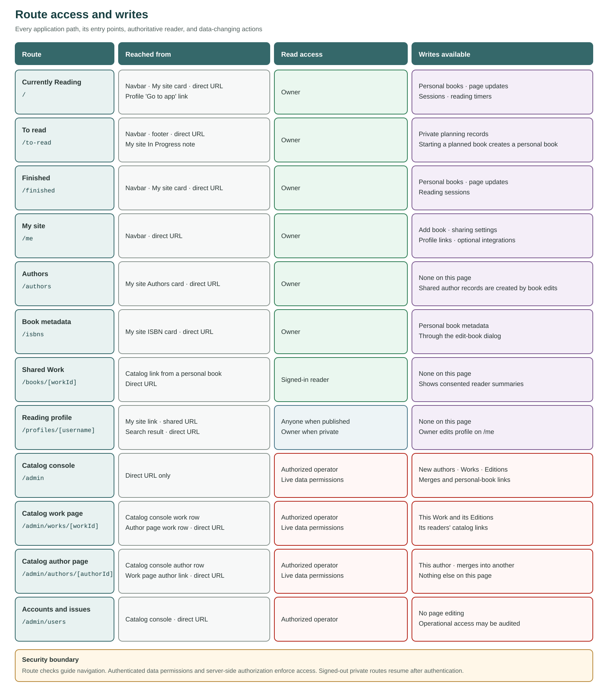
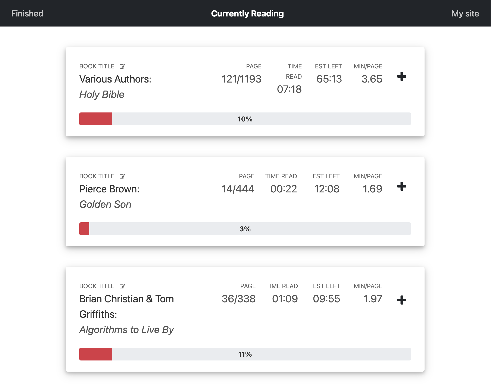
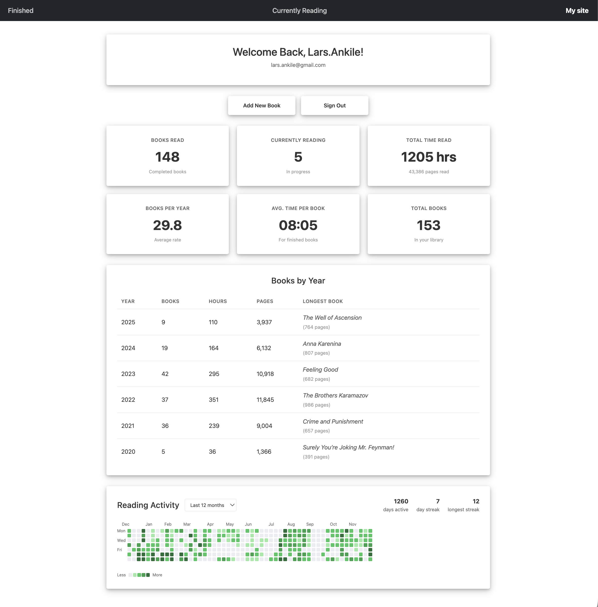

# The Stupid-Simple Book Tracker

[Book Tracker](https://book.ankile.com) is a responsive web app for tracking
books, reading progress, reading sessions, and reading statistics. It supports
offline work and optional public profiles.

New to the codebase? Start with the [architecture and site map](docs/architecture/README.md).

Any change to the architecture, routes, access model, data flows, or external
integrations must update the relevant map source and regenerate its image
artifacts in the same change. Keep every public map sanitized according to the
[architecture guide](docs/architecture/README.md#public-sanitization-rules).

## Architecture maps

These are the sanitized public views. The architecture guide contains the
editable Mermaid and JavaScript sources, PNG copies, and rendering commands.

### System context



### Application architecture



### Backend responsibilities and data flows



### Pages and navigation



### Route access and writes



## Screenshots

### Currently reading



### Profile and reading activity



## What the app does

- Adds, edits, and removes books from a personal library.
- Tracks page progress, finished books, and reading sessions.
- Starts and stops reading timers, including an optional time-tracking
  integration.
- Shows yearly statistics, reading streaks, a daily activity heatmap, and
  per-book reading speed.
- Supports author cleanup, merging, and classification within an account.
- Finds books whose ISBN data needs repair.
- Publishes an optional reading profile with a separate search-discovery
  setting.
- Provides a restricted, read-only operational overview.

The route catalog and access matrix live in the
[architecture guide](docs/architecture/README.md#route-catalog).

## Book metadata

The add and edit dialog can look up an ISBN through three catalog sources. The
requests are independent, so one unavailable source does not discard useful
responses from the others.

Metadata precedence is field-specific:

| Field | Preferred source | Fallbacks |
|---|---|---|
| Cover | Metered catalog | Open catalog, then national catalog |
| Fiction classification | Metered catalog | National catalog, then open catalog |
| Publisher and publication date | Open catalog | Metered catalog, then national catalog |
| Subjects | Open catalog | Metered catalog, then national catalog |

The lookup also fills empty title, author, and page-count inputs. It does not
silently replace values the user already entered.

Stored metadata is advisory display data. Firestore Rules allowlist the book
fields, validate their types and sizes, and restrict writes to the owner.
Application authorization must never depend on catalog metadata being correct.

Historical enrichment scripts are gap-fill migrations. They use a deliberate
source order and must follow the review, snapshot, rehearsal, and audit process
in [MIGRATIONS.md](MIGRATIONS.md). The Goodreads script is a manual historical
fallback only. It is not part of the live app or a scheduled workflow.

Books without a valid ISBN appear on `/isbns` and can be repaired through the
normal edit dialog.

## Requirements

- Node.js 22.18 or newer. `.nvmrc` pins the repository version.
- npm.
- Firebase CLI only for emulator and deployment work. Commands in this
  repository pin the CLI version.

## Set up the repository

```bash
git clone <repository-url>
cd book-tracker
npm ci
npm --prefix functions ci
```

The repository already contains its Firebase configuration. Do not run
`firebase init` in this checkout. It can replace tracked rules, indexes, and
deployment settings.

## Local development

Use the emulators for application development. This exercises Authentication,
Firestore, and Functions without sending application data or metered requests
to deployed services.

Start the emulators:

```bash
npm --prefix functions run serve
```

In another terminal, route the browser client to them:

```bash
VITE_EMULATOR=1 npm run dev
```

Open `http://localhost:5173`.

Plain `npm run dev` does not enable the emulators. It uses the Firebase
configuration bundled with the application and should be used only by someone
who understands and is authorized to access that environment.

### Build and preview

```bash
npm run build
npm run preview
```

The static build goes to `public/`. The build also creates the matching HTML
shell used for public profile rendering. Treat both outputs as one release
artifact.

## Testing

Run the default test suite:

```bash
npm test
```

Run the release validation suite before a deployment:

```bash
npm run validate
```

`validate` runs type and framework checks, unit tests, rules and emulator
tests, PWA tests, Functions tests, a production build, artifact checks, bundle
budgets, and dependency audits. The root audit excludes development-only
packages; the Functions audit checks its complete package tree.

Maintained source, tests, configuration, and repository tooling are
TypeScript-only. `public/service-worker.js` is the sole JavaScript exception:
it is generated from `src/service-worker.ts` during the build. Unit tests
enforce both this boundary and the absence of unchecked TypeScript escape
hatches.

Root package commands:

| Command | Purpose |
|---|---|
| `npm run dev` | Start the Vite development server |
| `npm run build` | Production build and renderer-shell synchronization |
| `npm run preview` | Preview the production build locally |
| `npm test` | Default checks and automated test suite |
| `npm run validate` | Release validation, build, artifact and bundle checks, and audits |
| `npm run check` | Svelte and TypeScript checks for the app, Node tools, and service worker |
| `npm run check:app` | SvelteKit synchronization and Svelte checks |
| `npm run check:node` | Type-check repository Node tools |
| `npm run check:service-worker` | Type-check the service worker |
| `npm run check:watch` | Watch-mode Svelte checks |
| `npm run test:unit` | Application and migration unit tests |
| `npm run test:rules` | Firestore Rules and integration tests against local emulators |
| `npm run test:functions` | Functions lint, production build, strict test type-check, and tests |
| `npm run test:pwa` | Service-worker and PWA behavior tests |
| `npm run test:artifacts` | Generated build and renderer artifact checks |
| `npm run test:bundle` | JavaScript and CSS bundle budgets |
| `npm run test:e2e` | Browser tests against local emulators |
| `npm run test:e2e:browser` | Run Playwright against an already running test environment |
| `node docs/architecture/verify.ts` | Route coverage, image freshness, and map sanitization |

Functions package commands:

| Command | Purpose |
|---|---|
| `npm --prefix functions test` | Lint and type-check production/test backend code, then run backend tests |
| `npm --prefix functions run lint` | Lint backend TypeScript |
| `npm --prefix functions run clean` | Remove compiled backend output |
| `npm --prefix functions run build` | Compile backend TypeScript |
| `npm --prefix functions run check:test` | Strictly type-check backend tests |
| `npm --prefix functions run serve` | Build and start the local emulator suite |
| `npm --prefix functions run shell` | Alias for the emulator workflow |
| `npm --prefix functions start` | Alias for the emulator workflow |
| `npm --prefix functions run deploy` | Deploy backend services with the pinned CLI |
| `npm --prefix functions run logs` | Read backend logs with the pinned CLI |

`npm test` intentionally omits the browser end-to-end suite, artifact checks,
and bundle budgets. `npm run validate` adds artifact and bundle checks. Run
`npm run test:e2e` separately when a change affects a complete browser flow.

## Deployment

Deployment requires authorized operator access and the private operational
runbooks. This public README documents the safe release boundary, not project
identifiers, service identities, secret names, quotas, incident commands, or
recovery credentials.

For a routine release:

1. Start from a clean branch and install locked dependencies with `npm ci` in
   both package roots.
2. Run `npm test` and any relevant browser end-to-end tests.
3. Run `npm run build` and `node docs/architecture/verify.ts`.
4. Review the generated web and profile-renderer artifacts together.
5. Commit the source and generated artifacts.
6. Run `npm run validate` from that clean commit. The artifact checks compare
   the generated files with `HEAD`, so this step belongs after the artifact
   commit and before deployment. Confirm the working tree remains clean.
7. Deploy the configured targets with the pinned CLI and follow the private
   verification and rollback runbooks.

```bash
npm exec --yes --package firebase-tools@15.24.0 -- firebase deploy
```

Hosting and the public profile renderer are coupled. Do not release Hosting by
itself. A routine release must not rerun database migrations, legacy
configuration exports, or completed rollout steps.

For any data-shape change, use [MIGRATIONS.md](MIGRATIONS.md) and the migration
script's own header. Production migration timing and emergency procedures stay
in private operator documentation.

## Project layout

```text
book-tracker/
├── src/
│   ├── lib/                 UI, stores, Firebase access, types, and utilities
│   └── routes/              SvelteKit pages
├── static/                  Static assets and screenshots
├── functions/
│   ├── src/                 Backend services and event handlers
│   └── test/                Functions tests
├── tests/                   App, rules, migration, PWA, and artifact tests
├── docs/architecture/       Sanitized map sources and rendered images
├── migrate-*.ts             One-time and maintenance migration tools
├── db-audit.ts              Read-only data consistency audit
├── db-snapshot.ts           Snapshot tool used before migrations
├── MIGRATIONS.md            Public-safe migration procedure and status ledger
├── firestore.rules          Application data permissions
├── firestore-secrets.rules  Restricted credential-store permissions
└── firebase.json            Emulator and deployment configuration
```

## Technology

- Svelte 5 and SvelteKit 2
- Vite 7 and TypeScript 5
- Bootstrap 5
- Firebase Authentication, Firestore, Functions, and Hosting
- Node.js 22 for backend services and repository tools

## Development notes

- Pages use SvelteKit file-based routing under `src/routes`.
- New components use Svelte 5 runes.
- Browser writes preserve offline behavior through Firestore's local cache.
- Navigation guards improve the user experience, but Rules and backend
  authorization are the security boundaries.
- Generated artifacts must match their source and committed revision.
- Changes to routes, architecture, access, data flows, or integrations must
  update and regenerate the maps.

## Troubleshooting

If the Node version is wrong:

```bash
nvm use
```

If dependencies are inconsistent, reinstall from the lockfiles:

```bash
npm ci
npm --prefix functions ci
```

If an emulator command fails because a port is already in use, stop the other
emulator process and rerun the command. Do not switch to deployed services as a
shortcut.

## Release history

Version 2 is the current application line. Earlier framework-upgrade notes are
historical and no longer part of setup or deployment. Database rollout status
is recorded in [MIGRATIONS.md](MIGRATIONS.md).

## License

MIT
