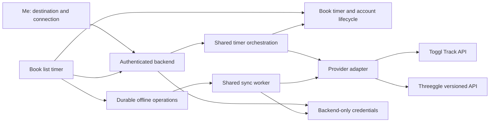

# Threeggle integration plan

Draft for review, September 12, 2026. No implementation or deployment is included in this pass.

Review threads: [Book Tracker PR #53](https://github.com/ankile/book-tracker/pull/53) and [Threeggle PR #2](https://github.com/ankile/threeggle/pull/2).

The initial review used Book Tracker at `1464be9`. This integration branch starts from published `master` at `252231d`, leaving the unmerged profile-read fix separate. The Threeggle branch starts from published `main` at `fe7e710`. Its timer API is unchanged from the initial review. API behavior below was verified in source, not against an authenticated production deployment.

## Recommendation

Add a persistent account setting with three choices: None, Toggl Track, and Threeggle. The user chooses it in Settings, and every timer uses that setting until they change it. There is no per-session provider picker and no writing to multiple providers. Preserve local timing, offline capture, and the existing reading-session dialog.

Use Book Tracker's backend to call Threeggle's token-authenticated HTTP API. Extend that API before connecting the apps. Its current start/switch and stop-current operations cannot safely handle delayed stops or completed offline sessions.

Share the timer lifecycle and queue orchestration between providers, with small adapters for their different API contracts. Keep existing Toggl endpoints and queued work compatible during rollout. A complete rewrite of the Toggl integration is unnecessary.

## Existing Book Tracker map

| Area | Current behavior | Main source |
|---|---|---|
| Connection | The Me page accepts a Toggl API token. The backend validates it and finds the first project named `Reading`. There is no project picker. | `src/routes/me/+page.svelte`, `functions/src/toggl.ts`, `savetoken` |
| Credentials | Backend-only credential storage is separate from browser-readable data. The user document exposes connection status and project/workspace IDs. | `functions/src/toggl.ts`, `src/lib/firebase/decoders.ts` |
| Start | With Toggl connected and the browser online, a callable claims the timer, creates the remote entry using the book title, then records its numeric ID and start time. | `src/lib/components/BookList.svelte`, `functions/src/toggl.ts`, `start` |
| Timer ownership | The book's active timer and one account-wide lifecycle claim must agree. States cover local, starting, remote, stopping, unknown outcome, and idle. This coordinates devices and books. | `src/lib/interfaces/book.ts`, `src/lib/utils/timerClaim.ts`, `firestore.rules` |
| Online stop | Stop the recorded Toggl entry. If it was already stopped, fetch its duration. Clear the matching timer and open Add reading with rounded minutes. | `functions/src/toggl.ts`, `stop`; `BookList.svelte` |
| Local timing | With no integration, or when starting offline, record a local start. The current code chooses whether to export a local interval using the connection status at stop time. | `BookList.svelte`, `src/lib/firebase/db.ts` |
| Offline stop | Atomically update the timer and enqueue either a completed interval or a stop for an existing remote ID. A remote stop keeps the account in `stopping` until synchronization confirms it. | `Database.stopTimerAndEnqueue`, `firestore.rules` |
| Queue processing | A Firestore worker claims rows, bounds retries and resource use, and updates the remote entry using the recorded stop time. Uncertain create outcomes require reconciliation to avoid duplicates. | `functions/src/toggl.ts`, `syncqueue`; `toggl-recovery.ts`, `togglQueueLimits.ts` |
| Recovery | A client sweep retries eligible stale/error rows and reports permanent failures or uncertain outcomes. It runs once per signed-in account per app session. | `src/lib/utils/toggl.ts`, `Database.retryStalledTogglSync` |
| Disconnect and deletion | Disconnect rejects an active lifecycle claim. Account deletion removes the credential and user data. | `functions/src/toggl.ts`, `cleartoken`; `functions/src/index.ts` |
| Diagnostics and tests | Decoders, Firestore rules, telemetry allowlists, audits, runtime tests, and emulator tests encode Toggl-specific shapes and transitions. | `tests/toggl*`, `functions/test/toggl-runtime.test.cts`, `db-audit.ts` |

Stopping a timer does not itself save a reading session. It opens the existing dialog with a duration suggestion. Saving or editing a reading session is a separate operation; the current integration does not synchronize those later edits to Toggl.

## What Threeggle supports today

The sources are `convex/integrations.ts`, `convex/http.ts`, `convex/schema.ts`, `convex/tracker.ts`, and `shared/tracker.ts` in the adjacent Threeggle repository. Setup is described in its `docs/integrations.md`.

| Capability | Verified contract | Implication |
|---|---|---|
| Authentication | Individually revocable connection tokens, created in Settings. Requests use a Bearer token; Threeggle stores its hash. | Create a dedicated Book Tracker connection. No shared login or OAuth flow is needed. |
| Endpoint | `POST /api/timer` on the Convex HTTP site, with an `action` field. | Book Tracker needs a configured server endpoint, not the frontend URL or Convex WebSocket URL. |
| Projects | `action: projects` returns active choices shaped as `{title, value}`. | Support an explicit project picker and suggest `Reading` when present. |
| Current activity | `action: current` returns an entry or null. Entries have string keys, versions, and millisecond timestamps. | Numeric Toggl entry IDs cannot be reused as the universal timer type. |
| Start | `action: start` accepts description, optional project, optional HTTPS task URL, request ID, and optional Unix-millisecond `at`. It switches away from a running activity. | Starting a reading timer can stop another activity. Make that behavior explicit and conditional on the activity the user saw. |
| Stop | `action: stop` stops the activity running when the request executes. It returns null after a successful stop. | A queued stop could stop an unrelated activity. There is no returned stopped-entry duration. |
| Retry handling | A repeated request ID prevents another mutation, but returns the activity running at retry time. Stored command records contain no original result or payload fingerprint. | Mutation deduplication exists, but reliable result recovery needs an extension. |
| Offline interval insertion | No completed-interval action is exposed by the timer HTTP API. | Replaying start followed by stop would interfere with current activity and is unsuitable. |
| Internal writes | `applyForUser` applies validated commands, updates history indexes and revisions, and requests Toggl sync. | New HTTP operations should use this write path. |
| Toggl bridge | Threeggle has optional bidirectional Toggl sync. | Book Tracker must not independently write the same session to both providers. |

No authenticated live requests were made. The Threeggle README and integration notes differ about which backend is used day to day. Confirm the intended deployed HTTP endpoint and API version during implementation, before enabling the connection.

## Proposed user experience

1. The Me page gets a Time tracking section and a destination selector. Existing connected users default to Toggl; other users default to None.
2. Choosing Threeggle offers instructions to create a connection token in Threeggle Settings. Book Tracker validates the token, loads projects, and saves the chosen project. Suggest `Reading`; require an explicit choice if there is no unique match. Do not create a project automatically.
3. Starting reading uses the selected destination. If Threeggle is already tracking another activity, show its description and offer to switch to reading or cancel. The actual switch checks the observed activity key and version atomically, so a concurrent change produces a conflict.
4. Stopping opens Add reading with the confirmed duration. If offline, use the locally recorded interval and show that the remote stop is pending.
5. If the user has already stopped or switched away from reading in Threeggle, retrieve that particular entry and use its existing end time. Do not stop the new activity or extend the old reading interval.
6. Show provider-specific connection and recovery messages. Conflicts retain the pending interval and offer reconciliation; a failed remote operation must not appear synced.
7. Capture the destination and connection revision at timer start, including local timers started offline. A later settings change cannot redirect that timer or its queue entry.
8. Switching destinations requires an idle lifecycle and resolved queued work. Apply the same condition when changing the connected account or project. Keep the first release simple: one active configuration, with no background draining to an old provider after a switch. Explicit recovery can resolve or abandon a failed export after the user has checked its remote outcome; retain the reading interval for manual recovery.

Disconnect removes Book Tracker's stored credential; revoking the connection in Threeggle remains a separate action. An invalid or externally revoked token pauses sync and prompts reconnection. Reconnecting to a different account must not replay old work there.

For the first release, timer creation and stopping are the integration scope. Historical import, automatic reading-session creation, editing remote entries after editing reading sessions, and general bidirectional book-data sync are separate features.

## Required Threeggle API extension

Add a versioned integration contract at `/api/time-tracking/v1`, while retaining `/api/timer` for existing CLI, shortcut, MCP, and Todoist clients. The names below are proposed, not existing API actions. The detailed producer contract and Threeggle file-level work breakdown live in the companion plan in [Threeggle PR #2](https://github.com/ankile/threeggle/pull/2).

| Operation | Request | Required result and behavior |
|---|---|---|
| Connection info | Authenticated read | Stable account identifier and supported API version/capabilities. Project listing can use the existing query. |
| Start | `requestId`, description, project ID, start time, `expectedRunningKey`, `expectedRunningVersion` | Atomically start or switch only if current activity still matches. Return the created entry's key, version, start, and any displaced activity's end. |
| Stop entry | `requestId`, `entryKey`, `expectedVersion`, recorded end time | Address the specific owned entry. Stop it only if its running version matches. If already stopped, return its actual interval without rewriting it. Never stop a different entry. |
| Create interval | `requestId`, description, project ID, start and end | Insert one completed interval without changing the current timer. Reject overlapping history for review, preserving the proposed interval in Book Tracker. Perform the overlap check and insert in one transaction, including a running entry. |
| Get entry | `entryKey` | Return the owned entry, including final times and version, or a typed missing result. Used to reconcile external edits or deletion. |
| Get operation | `requestId` | Return the original committed operation result, including its entry identity, or a typed unknown result. |

Every write requires a stable request ID. Store a canonical request fingerprint and its result atomically with the command. Identical retries return that result even if another timer now runs; reusing the ID with different arguments returns a conflict. Namespace IDs by authenticated account and integration client; include the action in the fingerprint so an ID reused for another action conflicts. Retain receipts for the lifetime of the account in the first release. This permits retries after long offline periods without a receipt-expiration ambiguity.

The operation receipt records what happened at execution time. A separate entry lookup reports subsequent edits or deletion. A recovered start must check the current state of its recorded entry before Book Tracker presents it as running.

Use typed response envelopes and error codes for invalid input, revoked credentials, missing entries, stale versions, time conflicts, and temporary failures. The existing API catches mutation errors as HTTP 409; the new route needs to distinguish a conflict requiring review from a failure eligible for retry.

Implement the new mutations through `applyForUser` to retain entry validation, revisions, history indexing, and optional Toggl propagation. Keep the existing timer route's behavior compatible. Add only the validation and failure handling required at the external API and asynchronous write boundaries; programming errors should remain visible.

## Book Tracker design

Expose provider-neutral start, stop, connection, and reconciliation callables to the new UI. They derive the provider from server-validated settings or the stored timer, never from an arbitrary client-supplied remote entry ID. Retain Toggl callable wrappers for old clients and in-flight work, but reject new legacy starts when the selected destination has changed.

The shared orchestration owns claims, atomic queue transitions, retry scheduling, quotas, and correlation checks. Adapters own authentication, response decoding, time precision, project lookup, and provider-specific recovery. Threeggle supports retryable creates after the receipt extension; Toggl's uncertain creates must retain their current reconciliation behavior.

### Data changes

| Model | Proposed change |
|---|---|
| User settings | Add selected provider and separate status-only connection records. Include project selection, stable remote account identity where available, and a server-assigned connection revision. Preserve the existing Toggl status during compatibility rollout. |
| Credential storage | Add Threeggle credentials to the existing protected storage boundary. Bind credentials to the connection revision and verified remote identity; expose no token to browser-readable documents, diagnostics, or profiles. |
| Active timer | Add a versioned provider discriminator and pinned connection reference. Distinguish local execution from export destination. Keep the original operation ID through all retries. |
| Remote reference | Use a discriminated union: Toggl has its numeric entry/workspace identity; Threeggle has a string entry key and version. Avoid coercing one provider's IDs into another's shape. |
| Lifecycle claim | Extend the existing single account-wide claim to the new timer shape. Include provider and connection in equality checks and recorded clear/stop transitions. Do not create separate locks per provider. |
| Queue | Introduce a provider-neutral queue for new operations, with immutable destination, connection revision, interval, remote reference where needed, and stable request ID. Retain the legacy Toggl queue worker until old rows are drained. |
| Recovery state | Store typed failure reasons and distinguish pending, processing, synced, retryable failure, conflict, and unknown outcome. Preserve correlated stop records until their timer claim is resolved. |

Use string-based ISO instants at the existing Book Tracker boundary, converting to milliseconds in the Threeggle adapter and whole seconds in the Toggl adapter. Freeze the requested stop time before sending or queuing it. Replay must not substitute reconnect time. Continue the existing minute rounding only for the reading dialog.

Existing providerless remote timers and legacy queues mean Toggl. Existing providerless local timers retain their old stop behavior until they finish. New timers always pin their destination at start. A compatibility decoder should normalize old data without forcing an immediate history migration.

Configuration changes and starts must coordinate through the same server transaction boundary so that a disconnect cannot pass an idle check while a start claims the account. Pinning alone does not prevent credential deletion races.

Offline devices may submit writes using a stale selection. Rules must reject a mismatched connection revision without deleting the local interval; the UI must retain and explain rejected pending work. Test this explicitly before rollout. Old clients cannot express the new provider shape, so switching to Threeggle also requires a refresh/update path for cached clients.

New offline timer intents need a small IndexedDB outbox owned by Book Tracker, separate from Firestore's cache. Persist the account ID, timer/operation IDs, pinned configuration, original start, and recorded stop before submitting the correlated Firestore batch. Start and stop records must survive reload and include enough data to reconstruct the interval without a book snapshot. If the local durability write fails, report it before presenting the action as saved. Firestore may remove a rejected optimistic write from its cache, so a rules rejection cannot be the acknowledgement that deletes this outbox record.

Remove an outbox record only after confirming the matching server claim/queue transition or an explicit user resolution. After an uncertain acknowledgement, read the server record and compare its operation identity before retrying. Replay only the same intent, never a new request ID or the newly selected provider. A rejected revision becomes a visible recovery item with the original interval, not an automatic write to the new connection. Reads and UI overlays must be scoped to the signed-in account; clear that account's local records on account deletion and define their handling in the existing sign-out/cache-reset workflow. Add browser tests for reload after rejection and lost acknowledgement, plus two-tab replay of the same outbox record.

### Credentials, diagnostics, and resource use

Reuse authenticated callables, verified-account connection setup, App Check, owner checks, account-deletion checks, bounded queue creation, and backend-only credentials. Configure the Threeggle service URL on the server; do not offer an arbitrary URL field. Use deterministic local provider responses during emulator tests so rehearsals cannot send real credentials or change a live timeline.

Update Firestore rules and indexes with the new shapes, plus account cleanup, audit checks, issue-event allowlists, retry reporting, and admin summaries. Logs should include provider, operation, and a bounded error code without tokens or book titles. Use provider-specific retry decisions and limits rather than copying Toggl's HTTP assumptions into Threeggle.

A first release needs no continuous Threeggle polling. Read current activity when starting and retrieve the recorded entry when stopping or reconciling. Revisit background reconciliation only if users need Book Tracker to reflect external stops immediately while idle.

## Implementation sequence

1. **Agree on behavior and contract.** The persistent destination setting is confirmed. Review the explicit switch prompt, project picker, overlap-conflict behavior, and API requests/results. Confirm the intended Threeggle deployment during implementation.
2. **Extend Threeggle.** Add the versioned API, account/capability response, targeted stop and lookup, completed-interval insertion, and durable operation receipts. Add contract tests. Preserve existing adapters and route behavior.
3. **Extract the Book Tracker lifecycle.** Separate Toggl HTTP operations from shared orchestration. Add versioned provider-aware models and compatibility decoding. Keep existing Toggl behavior passing before adding the new provider.
4. **Add Threeggle and settings.** Implement protected connection setup, project selection, provider selection, adapter operations, and provider-aware timer UI. Bind new timers to their connection revision.
5. **Complete offline and recovery paths.** Add the new queue worker, provider-aware sweep, rules, indexes, account cleanup, telemetry, and audit support. Test external edits and stale clients.
6. **Validate and release in stages.** Deploy the compatible Threeggle extension first. Then release Book Tracker backend/rules compatibility before enabling the new client path. Keep Threeggle selection disabled until its contract passes verification. Regenerate Book Tracker's relevant architecture sources and SVG/PNG artifacts in the implementation change, as required by the repository guide.

These are reviewable changes across two repositories. API correctness and offline/retry parity are the largest parts of the work; the connection form is small.

No bulk data migration is planned. If compatibility work proves to need stored-data changes, follow `MIGRATIONS.md` with a reviewed dry run, snapshot, and emulator rehearsal. Do not mix a migration into a routine deployment.

Rollback should disable new Threeggle starts while retaining the readers and workers needed to finish existing timers and queued operations. Rolling back to an old client/server that cannot read the new timer format is unsafe once that format has been written.

## Acceptance checks

| Scenario | Expected result |
|---|---|
| No provider or existing Toggl user | Local and Toggl timer flows retain their present behavior and session-dialog rounding. |
| Connect/disconnect | Valid token and active project connect; invalid/revoked tokens fail visibly. No credential reaches browser-readable storage. Account deletion removes both providers' credentials. |
| Normal Threeggle session | One remote entry with the selected project and book title; correct start/end and reading-dialog minutes. |
| Another activity is running | Explicit switch choice; concurrent activity changes cause conflict rather than stopping an unexpected timer. |
| Lost start response | Retry the same operation and recover the original entry, even after another activity starts. No duplicate. |
| Stop after external switch | Return the original reading entry's final interval and leave the new activity running. |
| Offline start and stop | Insert the completed interval once on reconnect without changing the current remote timer. Overlap conflicts retain the interval for review. |
| Online start, offline stop | Apply the recorded stop to the recorded entry. External edits/deletion are reconciled without rewriting newer history. |
| Duplicate delivery and crash | One remote mutation; recover after remote commit but before local confirmation. Changed payload with the same request ID is refused. |
| Multiple books, tabs, and devices | One account-wide timer claim; no concurrent starts or cross-provider stop. |
| Provider/account/project changes | Existing operations retain their original destination. Stale offline writes cannot be redirected or silently discarded. |
| Bridge enabled | Book Tracker writes only to Threeggle; Threeggle's existing bridge handles any Toggl copy. |
| Old data and cached clients | Legacy timers and queues finish; old clients cannot start Toggl after selecting Threeggle or corrupt new timer state. |

Use Threeggle's Convex tests for atomicity and contract behavior. Use Book Tracker's existing unit, backend runtime, rules/emulator, and browser suites for lifecycle and UI behavior. Run the normal release validation and architecture verification before deployment. Live smoke tests should use dedicated test entries and a revocable connection after implementation is approved.

## Coordinated branches, PRs, and delivery

| Repository | Branch and base | Responsibility |
|---|---|---|
| Book Tracker | `feat/threeggle-integration` from `master` | Account setting, adapter, shared lifecycle, queues, compatibility, and end-to-end release checklist. |
| Threeggle | `feat/book-tracker-integration` from `main` | Versioned API, targeted operations, receipts, authentication integration, and API contract tests. |

Both branches use dedicated worktrees and linked draft PRs. The agreed next step is review of both plans by Claude 5.1 Fable. Reconcile that feedback into the plans, then wait for the user's explicit implementation instruction before adding application code in either repository. The PR descriptions must say when they contain planning only; a plan PR is not evidence that the feature is implemented or tested. Keep both PRs open through implementation and mark them ready after the shared acceptance checks pass. No merge or deployment is part of this planning pass.

Threeggle [PR #1](https://github.com/ankile/threeggle/pull/1) is still open. It introduces timer/reconstruction token kinds, the `connectionToken` helper, and a versioned reconstruction route. This integration must not grant reconstruction tokens timer access. Prefer landing and reviewing that shared authentication work first if #1 is approved; otherwise carry the minimal compatible token-kind helper in the integration PR and resolve the overlap explicitly when either branch lands. The integration does not need reconstruction UI or proposal features. Re-test both token kinds and legacy tokens after reconciliation.

The Book Tracker profile-read fix changes `db.ts`, the Me page, and subscription behavior. If it lands first, rebase this integration and preserve those subscription changes. The finish forecast and security branches are independent work, not release prerequisites. Do not merge them just to clear the worktree inventory.

### Implementation checklist by repository

| Book Tracker work | Files or modules |
|---|---|
| Provider contracts and compatibility | `src/lib/interfaces/book.ts`, `src/lib/utils/timerClaim.ts`, both decoder modules; new shared provider/timer types compatible with the repository's shared-module build. |
| Backend split | Extract lifecycle orchestration and provider adapter contracts from `functions/src/toggl.ts`; add a Threeggle HTTP adapter and generic callable/queue entry points; retain Toggl wrappers. |
| Settings and timer UI | `src/routes/me/+page.svelte`, `src/lib/components/BookList.svelte`, `src/lib/firebase/functions.ts`; persist one account choice. |
| Local persistence and recovery | `src/lib/firebase/db.ts`, provider-neutral queue helpers, a new IndexedDB timer outbox module, and durable pending-operation recovery for rules-rejected offline writes. |
| Rules and maintenance | `firestore.rules`, `firestore.indexes.json`, `functions/src/index.ts`, `db-audit.ts`, telemetry decoders/reporting, admin diagnostics. |
| Tests and documentation | Extend timer/rules/runtime tests, add provider contract and browser flows, document configuration, and regenerate relevant architecture maps in the implementation commit. |

The companion Threeggle plan owns its detailed file list and wire contract. Both PRs should include the same versioned JSON request/response fixtures. Validate those fixtures with the real producer route in Convex tests and the consumer decoder/adapter tests in Book Tracker. Add local HTTP transport coverage so fixtures alone cannot hide a mismatch in authentication, serialization, or status codes.

### Merge and deployment checklist

- [ ] Finish both implementations and resolve overlap with whichever independent PRs have landed.
- [ ] Record the exact reviewed commit from each repository in both PR descriptions. Re-run affected checks after a rebase or review fix.
- [ ] Pass Threeggle lint, unit/Convex tests, Python adapter tests invoked with `python3 -m`, and build.
- [ ] Pass Book Tracker's normal release validation, relevant browser tests, and architecture verification. Follow its existing generated-artifact commit boundary.
- [ ] Run the shared scenarios across the two isolated local backends with dedicated test accounts. Neither test backend may contact the production timer provider or production Toggl bridge.
- [ ] Obtain approval for both code PRs before merging either as the coordinated feature release.
- [ ] Merge the additive Threeggle API change and deploy its backend first. Verify the capability response, token-kind enforcement, and API contract on the intended service with a dedicated connection.
- [ ] Merge and deploy Book Tracker's compatible backend/rules and required site/profile-renderer artifacts using its release runbook. Keep the new selection unavailable until capability validation succeeds.
- [ ] Enable Threeggle selection, connect the intended account/project, and exercise start/stop, one offline interval, and a retry. Record entry identities and outcomes without publishing credentials or private reading history.
- [ ] Confirm Toggl-only and None users retain their previous behavior. If the Threeggle bridge is enabled, verify one linked Toggl copy rather than a second independent export.
- [ ] After successful verification, remove the merged feature branches and their clean worktrees. Archive any non-regenerable ignored local files first.

The deployments are ordered within one release, not simultaneous. Threeggle's old route stays compatible while Book Tracker moves to the new contract. If validation fails after the producer deploy, leave the additive API in place and keep Threeggle selection disabled. If new timer data already exists, keep compatible readers and recovery workers running; disable new starts rather than reverting to code that cannot interpret those records.

## Confirmed behavior and remaining decisions

- Confirmed: one persistent account-level destination, with no per-session choice and no multiple-provider export.
- An explicit Threeggle project picker with `Reading` suggested when available.
- A prompt before switching away from another Threeggle activity.
- Preserve offline intervals with conflicts for review, rather than altering overlapping history.
- Extend Threeggle first, then add full online/offline support in Book Tracker.
- Keep reading-session saving and later corrections separate from remote timer synchronization in the first release.

## Review brief for Claude 5.1 Fable

Review both linked draft PRs as one proposed integration. They contain plans only. Read the existing timer, queue, rules, and Threeggle transaction code before recommending changes. Treat the persistent single-provider account setting as confirmed.

Focus the review on these questions:

1. Is extracting shared orchestration and adding a new queue justified, or can the same correctness be achieved with a smaller compatibility change?
2. Do the API receipts, targeted stops, and version checks cover lost responses, concurrent activity switches, external edits/deletions, and retries of rejected operations?
3. Is offline work durable when Firestore rejects a stale connection revision? Review the proposed local outbox, reload behavior, account scoping, and acknowledgement boundary, since a Firestore cache alone does not guarantee retention after a rejected write.
4. Can configuration changes, disconnect, account deletion, and old cached clients race with timer claims or queue creation? Identify any remaining route that can write to the wrong provider/account or leave a permanent lock.
5. Does the proposed overlap check use complete, bounded history reads and remain correct under concurrent writes? Should overlap review block export in the first release, as proposed?
6. Does the token-kind integration preserve the access separation introduced by Threeggle PR #1 in either merge order?
7. Are the producer/consumer fixtures and two-backend tests enough to catch real contract mismatches, and is the deployment/rollback order safe for active timers?

Return findings by severity with concrete failure sequences, affected plan sections/source files, and the smallest recommended plan change. Distinguish blocking correctness gaps from optional improvements. Do not implement, merge, or deploy as part of this review.
