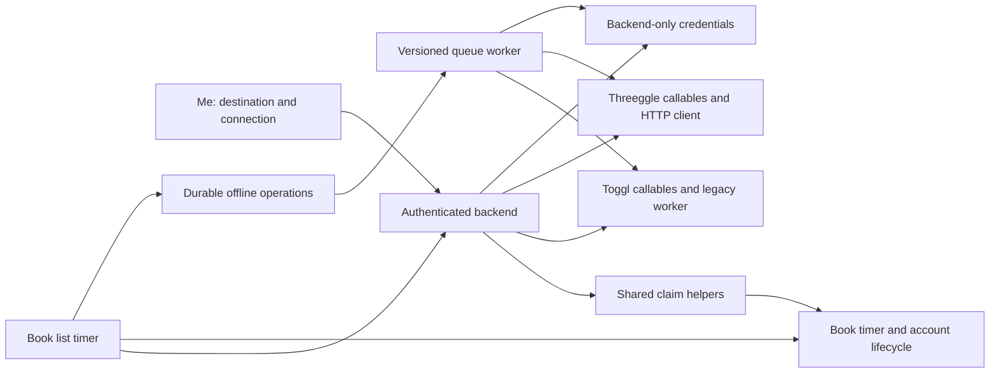

# Threeggle integration plan

Draft for review, September 12, 2026. No implementation or deployment is included in this pass.

Review threads: [Book Tracker PR #53](https://github.com/ankile/book-tracker/pull/53) and [Threeggle PR #2](https://github.com/ankile/threeggle/pull/2).

The initial review used Book Tracker at `1464be9`. This integration branch starts from published `master` at `252231d`, leaving the unmerged profile-read fix separate. The Threeggle branch starts from published `main` at `fe7e710`. Its timer API is unchanged from the initial review. API behavior below was verified in source, not against an authenticated production deployment.

## Recommendation

Add a persistent account setting with three choices: None, Toggl Track, and Threeggle. The user chooses it in Settings, and every timer uses that setting until they change it. There is no per-session provider picker and no writing to multiple providers. Preserve local timing, offline capture, and the existing reading-session dialog.

Use Book Tracker's backend to call Threeggle's token-authenticated HTTP API. Extend that API before connecting the apps. Its current start/switch and stop-current operations cannot safely handle delayed stops or completed offline sessions.

Extract the small timer-claim and correlation helpers shared by both providers. Add Threeggle callables and a separate queue for versioned operations, with explicit provider dispatch. Keep the existing Toggl worker and its retry semantics in place, making only the selection/revision guards and compatibility changes required below. Do not put the full Toggl implementation behind a new orchestration framework.

## Existing Book Tracker map

| Area | Current behavior | Main source |
|---|---|---|
| Connection | The Me page accepts a Toggl API token. The backend validates it and finds the first project named `Reading`. There is no project picker. | `src/routes/me/+page.svelte`, `functions/src/toggl.ts`, `savetoken` |
| Credentials | Backend-only credential storage is separate from browser-readable data. The user document exposes connection status and project/workspace IDs. | `functions/src/toggl.ts`, `src/lib/firebase/decoders.ts` |
| Start | With Toggl connected and the browser online, a callable claims the timer, creates the remote entry using the book title, then records its numeric ID and start time. | `src/lib/components/BookList.svelte`, `functions/src/toggl.ts`, `start` |
| Timer ownership | The book's active timer and one account-wide lifecycle claim must agree. States cover local, starting, remote, stopping, unknown outcome, and idle. This coordinates devices and books. | `src/lib/interfaces/book.ts`, `src/lib/utils/timerClaim.ts`, `firestore.rules` |
| Online stop | Stop the recorded Toggl entry. If it was already stopped, fetch its duration. Clear the matching timer and open Add reading with rounded minutes. | `functions/src/toggl.ts`, `stop`; `BookList.svelte` |
| Local timing | With no integration, or when starting offline, record a local start. The current code chooses whether to export a local interval using the connection status at stop time. | `BookList.svelte`, `src/lib/firebase/db.ts` |
| Offline stop | Atomically update the timer and enqueue either a completed interval or a stop for an existing remote ID. A remote stop keeps the account in `stopping` until synchronization confirms it. | `Database.stopTimerAndEnqueue`, `firestore.rules` |
| Queue processing | A Firestore worker claims rows, bounds retries and resource use, and updates the remote entry using the recorded stop time. Uncertain create outcomes require reconciliation to avoid duplicates. | `functions/src/toggl.ts`, `syncqueue`; `toggl-recovery.ts`, `togglQueueLimits.ts` |
| Recovery | A client sweep retries eligible stale/error rows and reports permanent failures or uncertain outcomes. It runs once per signed-in account per app session. | `src/lib/utils/toggl.ts`, `Database.retryStalledTogglSync` |
| Disconnect and deletion | Disconnect rejects an active lifecycle claim. Account deletion removes the credential and user data. | `functions/src/toggl.ts`, `cleartoken`; `functions/src/index.ts` |
| Diagnostics and tests | Decoders, Firestore rules, telemetry allowlists, audits, runtime tests, and emulator tests encode Toggl-specific shapes and transitions. | `tests/toggl*`, `functions/test/toggl-runtime.test.cts`, `db-audit.ts` |

Stopping a timer does not itself save a reading session. It opens the existing dialog with a duration suggestion. Saving or editing a reading session is a separate operation; the current integration does not synchronize those later edits to Toggl.

## What Threeggle supports today

The sources are `convex/integrations.ts`, `convex/http.ts`, `convex/schema.ts`, `convex/tracker.ts`, and `shared/tracker.ts` in the adjacent Threeggle repository. Setup is described in its `docs/integrations.md`.

| Capability | Verified contract | Implication |
|---|---|---|
| Authentication | Individually revocable connection tokens, created in Settings. Requests use a Bearer token; Threeggle stores its hash. | Create a dedicated Book Tracker connection. No shared login or OAuth flow is needed. |
| Endpoint | `POST /api/timer` on the Convex HTTP site, with an `action` field. | Book Tracker needs a configured server endpoint, not the frontend URL or Convex WebSocket URL. |
| Projects | `action: projects` returns active choices shaped as `{title, value}`. | Support an explicit project picker and suggest `Reading` when present. |
| Current activity | `action: current` returns an entry or null. Entries have string keys, versions, and millisecond timestamps. | Numeric Toggl entry IDs cannot be reused as the universal timer type. |
| Start | `action: start` accepts description, optional project, optional HTTPS task URL, request ID, and optional Unix-millisecond `at`. It switches away from a running activity. | Starting a reading timer can stop another activity. Make that behavior explicit and conditional on the activity the user saw. |
| Stop | `action: stop` stops the activity running when the request executes. It returns null after a successful stop. | A queued stop could stop an unrelated activity. There is no returned stopped-entry duration. |
| Retry handling | A repeated request ID prevents another mutation, but returns the activity running at retry time. Stored command records contain no original result or payload fingerprint. | Mutation deduplication exists, but reliable result recovery needs an extension. |
| Offline interval insertion | No completed-interval action is exposed by the timer HTTP API. | Replaying start followed by stop would interfere with current activity and is unsuitable. |
| Internal writes | `applyForUser` applies validated commands, updates history indexes and revisions, and requests Toggl sync. | New HTTP operations should use this write path. |
| Toggl bridge | Threeggle has optional bidirectional Toggl sync. | Book Tracker must not independently write the same session to both providers. |

No authenticated live requests were made. The Threeggle README and integration notes differ about which backend is used day to day. Confirm the intended deployed HTTP endpoint and API version during implementation, before enabling the connection.

## Proposed user experience

1. The Me page gets a Time tracking section and a destination selector. Existing connected users default to Toggl; other users default to None.
2. Choosing Threeggle offers instructions to create a connection token in Threeggle Settings. Book Tracker validates the token, loads projects, and saves the chosen project. Suggest `Reading`; require an explicit choice if there is no unique match. Do not create a project automatically.
3. Starting reading uses the selected destination. If Threeggle is already tracking another activity, show its description and offer to switch to reading or cancel. The actual switch checks the observed activity key and version atomically, so a concurrent change produces a conflict.
4. Stopping opens Add reading with the confirmed duration. If offline, use the locally recorded interval and show that the remote stop is pending.
5. If the user has already stopped or switched away from reading in Threeggle, retrieve that particular entry and use its existing end time. Do not stop the new activity or extend the old reading interval.
6. Show provider-specific connection and recovery messages. Conflicts retain the pending interval and display the bounded conflict snapshots returned by Threeggle. A failed remote operation must not appear synced. Recovery offers transport retry, a reviewed new export attempt, or explicit abandonment as defined below.
7. Capture the destination and connection revision at timer start, including local timers started offline. A later settings change cannot redirect that timer or its queue entry.
8. Switching destinations requires an idle lifecycle and resolved queued work. Apply the same condition when changing the connected account or project. Keep the first release simple: one active configuration, with no background draining to an old provider after a switch. Explicit recovery can resolve or abandon a failed export after the user has checked its remote outcome; retain the reading interval for manual recovery.

Disconnect removes Book Tracker's stored credential; revoking the connection in Threeggle remains a separate action. An invalid or externally revoked token pauses sync and prompts reconnection. Reconnecting to a different account must not replay old work there.

For the first release, timer creation and stopping are the integration scope. Historical import, automatic reading-session creation, editing remote entries after editing reading sessions, and general bidirectional book-data sync are separate features.

## Required Threeggle API extension

Add a versioned integration contract at `/api/time-tracking/v1`, while retaining `/api/timer` for existing CLI, shortcut, MCP, and Todoist clients. The names below are proposed, not existing API actions. The detailed producer contract and Threeggle file-level work breakdown live in the companion plan in [Threeggle PR #2](https://github.com/ankile/threeggle/pull/2).

| Operation | Request | Required result and behavior |
|---|---|---|
| Connection info | Authenticated read | Stable account identifier and supported API version/capabilities. Project listing can use the existing query. |
| Start | `requestId`, description, project ID, start time, `expectedRunning: null` or `{key, version}` | Atomically start or switch only if current activity still matches. Return the created entry's key, version, start, and any displaced activity's end. |
| Stop entry | `requestId`, `entryKey`, recorded end time | Address the specific owned entry. Use its current revision inside the mutation; a title/project edit does not block stopping it. If already stopped, return its actual interval without rewriting it. Never stop a different entry. |
| Create interval | `requestId`, description, project ID, start and end | Insert one completed interval without changing the current timer. Reject overlapping history for review, preserving the proposed interval in Book Tracker. Perform the overlap check and insert in one transaction, including a running entry. |
| Get entry | `entryKey` | Return the owned entry, including final times and version, or a typed missing result. Used to reconcile external edits or deletion. |
| Get operation | `requestId` | Return the original committed operation result, including its entry identity, or a typed unknown result. |

Every write requires a stable request ID. Store a canonical request fingerprint and its result atomically with the command. Identical retries return that result even if another timer now runs; reusing the ID with different arguments returns a conflict. Namespace IDs by authenticated account and integration client; include the action in the fingerprint so an ID reused for another action conflicts. Retain receipts for the lifetime of the account in the first release. This permits retries after long offline periods without a receipt-expiration ambiguity.

The producer must evaluate deterministic domain preconditions before `applyForUser`, save failed decisions as typed receipt values, and return them from the mutation. Throwing a conflict would roll back its receipt. The HTTP layer maps the returned status/envelope; unexpected exceptions still roll back and return 5xx. A replayed conflict remains that same conflict after the timeline changes. The companion plan specifies the complete error/receipt boundary.

The operation receipt records what happened at execution time. A separate entry lookup reports subsequent edits or deletion. A recovered start must check the current state of its recorded entry before Book Tracker presents it as running.

Use typed response envelopes and error codes for invalid input, revoked credentials, missing entries, stale start/switch expectations, time conflicts, and temporary failures. `interval_overlap` includes up to five conflicting entry snapshots and whether more exist; `running_changed` includes the current activity or null. Persist those details in the receipt and render them as the observation at the failed attempt, not as current history. The existing API catches mutation errors as HTTP 409; the new route needs to distinguish a conflict requiring review from a failure eligible for retry.

Implement the new mutations through `applyForUser` to retain entry validation, revisions, history indexing, and optional Toggl propagation. Keep the existing timer route's behavior compatible. Add only the validation and failure handling required at the external API and asynchronous write boundaries; programming errors should remain visible.

## Book Tracker design

Expose provider-neutral start, stop, connection, and reconciliation callables to the new UI. They derive the provider from server-validated settings or the stored timer, never from an arbitrary client-supplied remote entry ID. Retain Toggl callable wrappers for old clients and in-flight work, but reject new legacy starts when the selected destination has changed.

Extract `claimForTimer`, `timerMatchesClaim`, `transitionStartClaim`, `clearMatchedTimer`, and their decoders into a small `timerLifecycle.ts` module. Threeggle callables and the versioned worker use these helpers and the existing quota primitives. Keep provider-specific HTTP, retries, normalization, and recovery explicit. Reuse a narrow Toggl send helper for new versioned Toggl rows without refactoring the legacy `syncqueue` state machine. The new UI may use thin provider-neutral callable entry points; these do not require a general adapter framework. Threeggle supports replayable creates after its receipt extension; Toggl's uncertain creates keep their current manual reconciliation behavior.

### Data changes

| Model | Proposed change |
|---|---|
| User settings | Add selected provider and an active status-only connection revision in the default database. Include project and stable remote identity. Preserve `users/{uid}.toggl` only while the effective destination is Toggl; remove it transactionally when switching away. |
| Credential storage | Add Threeggle credentials to the existing protected storage boundary. Bind credentials to the connection revision and verified remote identity; expose no token to browser-readable documents, diagnostics, or profiles. |
| Active timer | Add a versioned provider discriminator and pinned connection reference. Distinguish local execution from export destination. Keep the original operation ID through all retries. |
| Remote reference | Use a discriminated union: Toggl has its numeric entry/workspace identity; Threeggle has a string entry key and version. Avoid coercing one provider's IDs into another's shape. |
| Lifecycle claim | Extend the existing single account-wide claim to the new timer shape. Include provider and connection in equality checks and recorded clear/stop transitions. Do not create separate locks per provider. |
| Queue | Introduce a separate versioned queue keyed by operation ID, with immutable destination, revision, original interval, server-prepared frozen provider payload, and request ID. Retain synced rows rather than deleting them; keep terminal rows for the account lifetime in the first release. Retain the legacy worker until old rows drain. |
| Operation acknowledgement | Each new local start/stop/clear batch also creates an immutable acknowledgement keyed by operation ID, atomically with its claim/queue transition. Rules permit it only with the matching transition; it proves server acceptance, not remote sync. Server callables create equivalent acknowledgements. Retain these small records for the account lifetime, including None operations, so later claims cannot erase the evidence. |
| Recovery state | Store typed failure reasons and distinguish pending, processing, synced, retryable failure, conflict, superseded, abandoned, and unknown outcome. Preserve correlated stops until resolved. A reviewed new attempt gets a new ID and an atomic link to its superseded predecessor. |

A timer session has one `timerId`, while its start, stop, explicit clear, and reviewed new export each have distinct operation UUIDs. Each operation reuses its own UUID through transport retries; start and stop must never share a Threeggle request ID. Acknowledgements record the operation ID, timer ID, phase, intent fingerprint, provider, and revision. Legacy queue IDs remain unchanged. Rules derive the new queue/acknowledgement ID from the correlated operation, not a client-chosen unrelated document name.

Use ISO instants at the existing Book Tracker boundary, milliseconds for Threeggle, and whole seconds for Toggl. Freeze the original intent when the user stops. Before the first Threeggle send, persist one normalized provider payload under the request ID; every retry uses those exact bytes/arguments. Recomputing a clock clamp on retry would change the fingerprint and is prohibited. Online starts use backend time. Continue minute rounding only in the reading dialog.

For a remote stop, cap a future recorded end at backend now, retaining the original end and the applied adjustment on the queue row. If that cap would precede the authoritative remote start, defer before preparing/sending the payload until a valid end is possible. For a completed local interval, cap its end at backend now and shift the start backward by the same amount, preserving its positive duration; independently clamping both ends could collapse it to zero. Invalid original ordering is a review error, not something to normalize away. Threeggle allows at most 1,000 ms of future clock tolerance; larger remaining service-clock skew returns retryable `clock_ahead` with `Retry-After`, without a negative receipt, so an unchanged frozen payload can succeed when time catches up. Test both fast-device and backend-clock-skew cases.

### Legacy clients and reader rollout

Existing providerless remote timers and legacy queues mean Toggl. Providerless local timers retain their old stop behavior only while the destination remains unchanged. Compatibility decoders normalize old data without a history rewrite. A missing new setting derives Toggl from the old status map, otherwise None; an explicit setting always wins.

Close every legacy write path when the destination changes: `togglConfigured` requires effective destination Toggl, selection away from Toggl removes the old status mirror, and legacy `start`, `savetoken`, and queue workers enforce the same selection. Rules refuse v1 local starts on an account configured for Threeggle, and refuse legacy Toggl `create` rows when the selected destination is None or Threeggle. This includes stale clients whose cached mirror still exists. A rejected atomic batch leaves server timer/claim state intact; a pre-outbox client's unsent intent is not guaranteed durable after cache rejection. Require those devices to sync and update before cutover, rather than promising retroactive outbox protection.

A legacy `savetoken` may initialize Toggl only for an account with no explicit destination setting, an idle claim, and no unresolved work. It uses the same revision transaction. It cannot override an explicit None/Threeggle selection. The new settings callable handles an intentional provider change.

The old client decoder rejects extra timer fields and can fail the whole library snapshot. Ship client/functions decoders, audit readers, and diagnostics that understand both v1 and v2 before enabling any v2 writers, including Toggl/None writers. Keep strict validation of the supported versions; do not silently accept arbitrary malformed data. Publish the service-worker update and require the opting-in user's devices to sync and reload. A waiting period alone does not prove every offline PWA updated. A pre-reader client that returns later may need a refresh to recover its library; its writes remain gated. Verify this exact old-client/new-data case.

### Connection revision and credential ordering

Credentials remain in the separate secrets database; there is no cross-database transaction. The default-database active connection revision is the authorization boundary. Start claims read that revision and the lifecycle in the same transaction, verify that the selected provider/revision matches the credential they obtained, and pin it in the claim before a remote request. New offline batches validate the revision in Rules alongside their correlated claim transition.

Switch/disconnect runs a default-database transaction that reads the revision, requires an idle lifecycle, checks both queues for unresolved work, and clears/replaces the revision and old Toggl mirror. Only after that commit may it delete the old credential. If start wins first, disconnect sees the non-idle claim and fails; if disconnect wins first, start cannot acquire the old revision. Stage a replacement credential before activating its new revision and clean up an unactivated credential after a failed activation. Recheck account tombstones and preserve the existing deletion cleanup ordering.

A worker loads credentials by its pinned revision. A missing credential pauses that row in a visible reconnect/review state and never redirects it or retries indefinitely. Reconnecting the same verified service/account/project may repair the credential under the same logical revision so pending stops can drain. Connecting a different identity/project creates a new revision and remains blocked by unresolved work. Add emulator interleavings for start vs disconnect, switch vs an offline batch, credential activation failure, and deletion.

### Outbox acknowledgement and replay

New offline timer intents need a small IndexedDB outbox owned by Book Tracker, separate from Firestore's cache. Persist the account ID, timer/operation IDs, pinned configuration, original start, and recorded stop before submitting the correlated Firestore batch. Start and stop records must survive reload and include enough data to reconstruct the interval without a book snapshot. If the local durability write fails, report it before presenting the action as saved. Firestore may remove a rejected optimistic write from its cache, so a rules rejection cannot be the acknowledgement that deletes this outbox record.

On reconnect, serialize outbox reconciliation across tabs for the account, wait for Firestore's own persisted writes using `waitForPendingWrites()`, then read the durable operation acknowledgement and queue from the server. The barrier waits only when online and must not block the offline timer UI. A successful batch promise or matching acknowledgement permits removal from the outbox; the retained queue now owns remote work. A synced row confirms sync, while an acceptance acknowledgement alone must not be labelled synced. An absent queue or an unrelated `idle.cleared` value is never proof that the original batch did not land.

If the acknowledgement is absent after the barrier, retry only the identical intent while its claim/revision preconditions still hold. On any batch rejection, re-read the operation acknowledgement and queue before marking it failed, because another tab may have committed it. Retaining synced rows and operation acknowledgements for the account lifetime avoids the same false failure after a short queue TTL. Include None timers and start/clear transitions in acknowledgement tests. Rules/emulator checks must prove acknowledgement immutability, exact batch correlation, access-call/expression budgets, and that fabricated acknowledgements cannot authorize remote work. Do not delete or replay legacy uncertain Toggl creates through this mechanism.

Rejected revision writes become visible recovery items with their original interval. Reads, tab locks, and overlays are account-scoped. On sign-out with unacknowledged local work, offer to wait for sync or explicitly discard it and sign out; explain that a remote timer may still need stopping. The explicit discard path and account deletion clear the outbox with the existing cache-reset flow. Never silently erase a pending interval or retain it as another user's accessible data. Test reload after rejection, late Firestore flush, remote success before acknowledgement, another completed timer overwriting the claim, and simultaneous two-tab replay.

### Recovery decisions

Transport retry reuses the original request ID and frozen provider payload. For a definitive Threeggle conflict or non-applied terminal validation failure, offer **Retry as new export** after showing the saved conflict details and re-reading current context where needed. The user can first correct the conflicting history in Threeggle. A backend transaction verifies the old row is terminal and has no live/unknown remote attempt, marks it superseded, and creates exactly one linked successor with a new request ID, the same interval and pinned connection. For a correlated stop, atomically move the existing `stopping` claim to the successor queue ID without releasing the account lock. A double-click or second device must return the same successor.

A clock correction is likewise a reviewed new decision with original and corrected times retained. Abandonment marks the row resolved with an explicit reason; clearing a correlated remote stop also requires confirmation that the remote timer has been stopped/deleted and a transaction matching the claim. An `outcome-unknown` Toggl create cannot use the new-export action until its remote outcome is checked. Successful/synced rows never offer it. These actions prevent permanent locks without silently duplicating or rewriting history.

### Credentials, diagnostics, and resource use

Reuse authenticated callables, verified-account connection setup, App Check, owner checks, account-deletion checks, bounded queue creation, and backend-only credentials. Configure the Threeggle service URL on the server; do not offer an arbitrary URL field.

A server-owned runtime control contains `threeggleEnabled` and `timerWriteVersion`, defaulting to false and v1. New connection/selection and online start callables read the enable flag; Rules also gate Threeggle local starts, otherwise an offline client could bypass a callable-only kill switch. Existing stops, queued work, receipt reads, and same-identity credential repair remain available while disabled. `timerWriteVersion` enables v2 only after compatible readers ship; once v2 exists, disabling new starts never downgrades readers or recovery workers. Operators change these controls without deploying code; clients read only a status projection for UI availability.

The Threeggle emulator transport has two explicit server-configured modes: deterministic stub for ordinary tests, or an isolated loopback Convex HTTP site for the two-backend test. In emulator mode, reject every non-loopback HTTP target and every production endpoint before making a request. No redirect may escape that boundary. Test this in the backend containment suite. Both modes keep the Toggl bridge disabled or mocked; production never accepts the loopback configuration.

Update Firestore rules and indexes with the new shapes, plus account cleanup, audit checks, issue-event allowlists, retry reporting, and admin summaries. Logs should include provider, operation, and a bounded error code without tokens or book titles. Use provider-specific retry decisions and limits rather than copying Toggl's HTTP assumptions into Threeggle.

A first release needs no continuous Threeggle polling. Read current activity when starting and retrieve the recorded entry when stopping or reconciling. Revisit background reconciliation only if users need Book Tracker to reflect external stops immediately while idle.

## Implementation sequence

1. **Agree on behavior and contract.** The persistent destination setting is confirmed. Review the explicit switch prompt, project picker, overlap-conflict behavior, and API requests/results. Confirm the intended Threeggle deployment during implementation.
2. **Extend Threeggle.** Add the versioned API, account/capability response, targeted stop and lookup, completed-interval insertion, and durable operation receipts. Add contract tests. Preserve existing adapters and route behavior.
3. **Extract the Book Tracker claim helpers.** Move only the identified helpers/decoders, add the selection and revision guards, and preserve the legacy Toggl state machine. Add versioned models and compatibility readers before enabling writers.
4. **Add Threeggle and settings.** Implement protected connection setup, project selection, provider selection, adapter operations, and provider-aware timer UI. Bind new timers to their connection revision.
5. **Complete offline and recovery paths.** Add the new queue worker, provider-aware sweep, rules, indexes, account cleanup, telemetry, and audit support. Test external edits and stale clients.
6. **Validate and release in stages.** Deploy the compatible Threeggle extension first. Ship Book Tracker client/backend/audit readers while writes remain v1, complete the device sync/update step, and then enable writers through the runtime controls. Regenerate relevant architecture sources and SVG/PNG artifacts in the implementation change.

These are reviewable changes across two repositories. API correctness and offline/retry parity are the largest parts of the work; the connection form is small.

No bulk data migration is planned. If compatibility work proves to need stored-data changes, follow `MIGRATIONS.md` with a reviewed dry run, snapshot, and emulator rehearsal. Do not mix a migration into a routine deployment.

Rollback should disable new Threeggle starts while retaining the readers and workers needed to finish existing timers and queued operations. Rolling back to an old client/server that cannot read the new timer format is unsafe once that format has been written.

## Acceptance checks

| Scenario | Expected result |
|---|---|
| No provider or existing Toggl user | Local and Toggl timer flows retain their present behavior and session-dialog rounding. |
| Connect/disconnect | Valid token and active project connect; invalid/revoked tokens fail visibly. No credential reaches browser-readable storage. Account deletion removes both providers' credentials. |
| Normal Threeggle session | One remote entry with the selected project and book title; correct start/end and reading-dialog minutes. |
| Another activity is running | Explicit switch choice; concurrent activity changes cause conflict rather than stopping an unexpected timer. |
| Lost start response | Retry the same operation and recover the original entry, even after another activity starts. No duplicate. |
| Stop after external switch | Return the original reading entry's final interval and leave the new activity running. |
| Offline start and stop | Insert the completed interval once on reconnect without changing the current remote timer. Overlap conflicts retain the interval for review. |
| Online start, offline stop | Target the recorded entry, retain title/project edits, return an already-stopped interval, and show invalid edited-start/deletion results for recovery. Never stop the replacement activity. |
| Duplicate delivery and crash | One remote mutation; recover after remote commit but before local confirmation. Changed payload with the same ID is refused. A conflict replayed after the conflicting activity disappears still returns the original negative receipt. |
| Multiple books, tabs, and devices | One account-wide timer claim; no concurrent starts or cross-provider stop. |
| Provider/account/project changes | Existing operations retain their original destination. New-client stale offline writes survive in the outbox. Legacy writers are refused after cutover and must sync/update before selection changes; they have no retroactive outbox guarantee. |
| Bridge enabled | Book Tracker writes only to Threeggle; Threeggle's existing bridge handles any Toggl copy. |
| Old data and cached clients | Drain legacy work before switching; deny legacy Toggl queue creates under None/Threeggle. Ship v2 readers before writers; a pre-reader cached client may need refresh but cannot corrupt state. |
| Disconnect/start race | A default-database revision transaction serializes claim acquisition with disconnect; credential deletion follows commit. Same-identity repair drains a pinned stop without switching accounts. |
| Outbox acknowledgement | Firestore's pending writes settle before replay. Durable acknowledgements survive queue completion and newer claims. Rejected duplicate batches re-read acceptance and do not become false recovery items. |
| Recovery successor | A double-click or second device creates one successor for a definitive conflict; its new ID is distinct from transport replay and its correlated stop retains the account lock. |
| Clock skew | Persist one normalized payload before first send; replay bytes stay identical. Preserve local duration and original intent. Transient producer-clock skew retries without a permanent receipt. |
| Runtime controls and containment | Disabled Threeggle rejects new online/offline starts but permits pending stops/recovery. The two-backend test permits only an isolated loopback provider; ordinary emulator tests use a stub. |

Use Threeggle's Convex tests for atomicity and contract behavior. Use Book Tracker's existing unit, backend runtime, rules/emulator, and browser suites for lifecycle and UI behavior. Run the normal release validation and architecture verification before deployment. Live smoke tests should use dedicated test entries and a revocable connection after implementation is approved.

## Coordinated branches, PRs, and delivery

| Repository | Branch and base | Responsibility |
|---|---|---|
| Book Tracker | `feat/threeggle-integration` from `master` | Account setting, adapter, shared lifecycle, queues, compatibility, and end-to-end release checklist. |
| Threeggle | `feat/book-tracker-integration` from `main` | Versioned API, targeted operations, receipts, authentication integration, and API contract tests. |

Both branches use dedicated worktrees and linked draft PRs. Claude Fable 5.1's combined review is published and reconciled in the disposition table below. Wait for the user's explicit implementation instruction before adding application code in either repository. The PR descriptions must say when they contain planning only; a plan PR is not evidence that the feature is implemented or tested. Keep both PRs open through implementation and mark them ready after the shared acceptance checks pass. No merge or deployment is part of this planning pass.

Threeggle [PR #1](https://github.com/ankile/threeggle/pull/1) is still open. It owns token kinds and the creation UI. If it lands first, the integration reuses its full `connectionToken` helper. If the integration lands first, it adds only a legacy-token shim with the same signature; the second branch to land must adopt the full helper and pass token-kind denial tests on every new action. No reconstruction-token fixture is valid under the older schema. The integration does not need reconstruction UI or proposal features.

The Book Tracker profile-read fix changes `db.ts`, the Me page, and subscription behavior. If it lands first, rebase this integration and preserve those subscription changes. The finish forecast and security branches are independent work, not release prerequisites. Do not merge them just to clear the worktree inventory.

### Implementation checklist by repository

| Book Tracker work | Files or modules |
|---|---|
| Provider contracts and compatibility | `src/lib/interfaces/book.ts`, `src/lib/utils/timerClaim.ts`, `src/lib/firebase/decoders.ts`, `functions/src/decoders.ts`, `db-audit.ts`, and admin diagnostics explicitly gain v2 readers before writers activate. |
| Backend split | Extract only claim/correlation helpers into `timerLifecycle.ts`; add `threeggle.ts`, a narrow HTTP client, and the versioned worker. Preserve the legacy Toggl state machine apart from required selection/revision guards. |
| Settings and timer UI | `src/routes/me/+page.svelte`, `src/lib/components/BookList.svelte`, `src/lib/firebase/functions.ts`; persist one account choice. |
| Local persistence and recovery | `src/lib/firebase/db.ts`, provider-neutral queue helpers, a new IndexedDB timer outbox module, and durable pending-operation recovery for rules-rejected offline writes. |
| Rules and maintenance | `firestore.rules`, `firestore.indexes.json`, `functions/src/index.ts`, `db-audit.ts`, telemetry decoders/reporting, admin diagnostics. |
| Tests and documentation | Extend timer/rules/runtime tests, add provider contract and browser flows, document configuration, and regenerate relevant architecture maps in the implementation commit. |

The companion Threeggle plan owns its detailed file list and wire contract. Both PRs should include the same versioned JSON request/response fixtures. Validate those fixtures with the real producer route in Convex tests and the consumer decoder/adapter tests in Book Tracker. Add local HTTP transport coverage so fixtures alone cannot hide a mismatch in authentication, serialization, or status codes.

### Merge and deployment checklist

- [ ] Finish both implementations and resolve overlap with whichever independent PRs have landed.
- [ ] Record the exact reviewed commit from each repository in both PR descriptions. Re-run affected checks after a rebase or review fix.
- [ ] Pass Threeggle lint, unit/Convex tests, Python adapter tests invoked with `python3 -m`, and build.
- [ ] Pass Book Tracker's normal release validation, relevant browser tests, and architecture verification. Follow its existing generated-artifact commit boundary.
- [ ] Run the shared scenarios across the two isolated local backends with dedicated test accounts. Neither test backend may contact the production timer provider or production Toggl bridge.
- [ ] Obtain approval for both code PRs before merging either as the coordinated feature release.
- [ ] Merge the additive Threeggle API change and deploy its backend first. Verify the capability response, token-kind enforcement, and API contract on the intended service with a dedicated connection.
- [ ] Merge and deploy Book Tracker's v1/v2 client, functions, audit, and diagnostic readers with `timerWriteVersion` still v1 and `threeggleEnabled` false. Deploy the required site/profile-renderer artifacts together under its release runbook.
- [ ] Verify reader compatibility and the service-worker update; sync/reload the user's devices and drain legacy work before cutover. Document the refresh requirement for a pre-reader PWA returning later.
- [ ] Validate producer capabilities, then change server-owned `timerWriteVersion` and `threeggleEnabled` to allow v2 and Threeggle selection. Connect the intended account/project and exercise start/stop, offline interval, and retry with dedicated entries.
- [ ] Disable `threeggleEnabled` once during verification: new online and offline Threeggle starts must be refused, while existing stops/recovery still complete. Re-enable only after that test passes.
- [ ] Confirm Toggl-only and None users retain their previous behavior. If the Threeggle bridge is enabled, verify one linked Toggl copy rather than a second independent export.
- [ ] After successful verification, remove the merged feature branches and their clean worktrees. Archive any non-regenerable ignored local files first.

The deployments are ordered within one release, not simultaneous. Threeggle's old route stays compatible while Book Tracker moves to the new contract. If validation fails after the producer deploy, leave the additive API in place and keep Threeggle selection disabled. If new timer data already exists, keep compatible readers and recovery workers running; disable new starts rather than reverting to code that cannot interpret those records.

## Confirmed behavior and remaining decisions

- Confirmed: one persistent account-level destination, with no per-session choice and no multiple-provider export.
- An explicit Threeggle project picker with `Reading` suggested when available.
- A prompt before switching away from another Threeggle activity.
- Preserve offline intervals with conflicts for review, rather than altering overlapping history.
- Extend Threeggle first, then add full online/offline support in Book Tracker.
- Keep reading-session saving and later corrections separate from remote timer synchronization in the first release.

## Review brief for Claude 5.1 Fable

Review both linked draft PRs as one proposed integration. They contain plans only. Read the existing timer, queue, rules, and Threeggle transaction code before recommending changes. Treat the persistent single-provider account setting as confirmed.

Focus the review on these questions:

1. Is extracting shared orchestration and adding a new queue justified, or can the same correctness be achieved with a smaller compatibility change?
2. Do the API receipts, targeted stops, and version checks cover lost responses, concurrent activity switches, external edits/deletions, and retries of rejected operations?
3. Is offline work durable when Firestore rejects a stale connection revision? Review the proposed local outbox, reload behavior, account scoping, and acknowledgement boundary, since a Firestore cache alone does not guarantee retention after a rejected write.
4. Can configuration changes, disconnect, account deletion, and old cached clients race with timer claims or queue creation? Identify any remaining route that can write to the wrong provider/account or leave a permanent lock.
5. Does the proposed overlap check use complete, bounded history reads and remain correct under concurrent writes? Should overlap review block export in the first release, as proposed?
6. Does the token-kind integration preserve the access separation introduced by Threeggle PR #1 in either merge order?
7. Are the producer/consumer fixtures and two-backend tests enough to catch real contract mismatches, and is the deployment/rollback order safe for active timers?

Return findings by severity with concrete failure sequences, affected plan sections/source files, and the smallest recommended plan change. Distinguish blocking correctness gaps from optional improvements. Do not implement, merge, or deploy as part of this review.

## Review disposition

Author responses to [Claude Fable 5.1's combined review](https://github.com/ankile/book-tracker/pull/53#pullrequestreview-5188253316). These are plan fixes, not implementation or reviewer approval. The original reviewed head was `1be958f`.

| Finding | Plan response |
|---|---|
| BT-1 | Added effective-provider gates to legacy rules/callables/workers and removal of the old Toggl mirror on switch. Defined stale-client rejection and the limits of pre-outbox durability. |
| BT-2 | Made client/functions/audit readers a separate release gate before any v2 writes; documented stale-PWA refresh and device sync before cutover. |
| BT-3 | Defined the default-database revision transaction, post-commit secret deletion, credential activation ordering, and same-identity repair. |
| BT-4 | Retained synced rows and added durable operation acknowledgements, a pending-writes barrier, and rejection re-read. Account-lifetime retention avoids replay ambiguity after a TTL, including None/start/clear operations. |
| BT-5 | Added one-time persisted normalization, preserved original intent and local duration, and transient producer-clock retries. Recomputing the clamp on retry is explicitly forbidden. |
| BT-6 | Named runtime controls and stub/loopback emulator modes. Extended the recommended callable gate to Rules because local offline starts otherwise bypass it. |
| BT-7 | Limited extraction to named claim/correlation helpers and a narrow send helper. Kept the legacy worker's state machine, with only the guards needed by BT-1/BT-3. |
| BT-8 | Defined reviewed new-export successors, terminal/unknown eligibility, atomic stop-claim transfer, and double-submit deduplication. |
| TG-1 cross-reference | Matched the producer's returned negative-receipt design and added conflict-after-timeline-change replay to acceptance checks. |
| TG-2 cross-reference | Removed caller `expectedVersion` from targeted stop; preserve title/project edits and use the current version inside the producer mutation. |
| TG-3 cross-reference | Specified bounded conflict snapshots, their age, and how recovery displays/rechecks them. |
